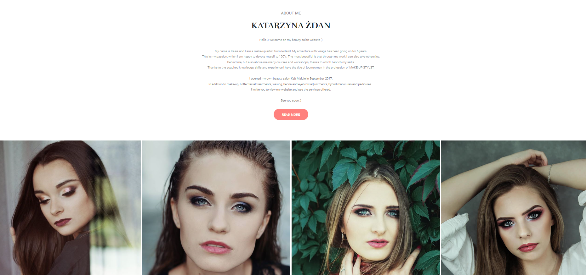
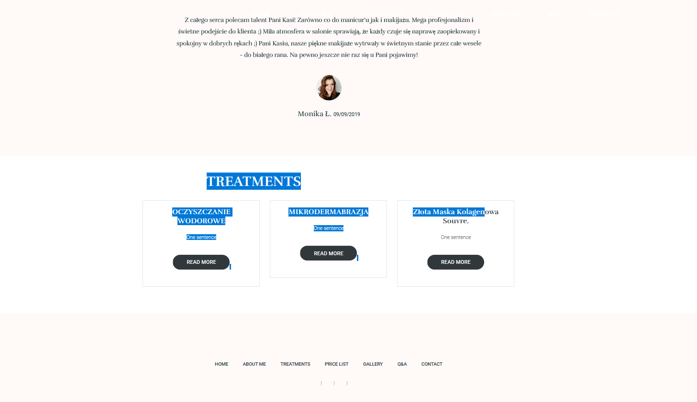

# REDI Sprint 2020 Frontend Development 2, Final Project

Application Name: **Beauty salon website**.

Student Name: **Anna Danielkiewicz**

## DESCRIPTION

Beauty salon webpage will be a site sreated for a real make-up artist who has FB and a blog but no website. 
In my opinion it is the project in which I can use the knowledge acquired during the course and also be creative.

The **site map** which you see below you can find here: https://octopus.do/k4t06brxa7g

## DESIGN

## IDEAS
--> **PRICE LIST** sub
**VOUCHER** -> Below the price list there would be a voucher wizard, where you should provide email, phone number, first and last name and who the voucher will be for. If no service has been selected / added to the voucher, the voucher is for the amount entered by the user. If the user has checked the services, the voucher will be for specific service names.

--> **Q & A** sub
**CONTACT FORM** -> If the user has not found the answer to his questions, he can fill out the contact form by entering his email (not obligatory) and the content of the question.

--> **HOME PAGE** sub
CONTACT -> google map location link,
        -> the review section changes automatically one by one,
        -> the makeup section moves in one row with the click and movement of the user's computer mouse.

**Other Important aspects I will have to face:**
- website and data security,
- privacy policy,
- proper display of the page on every device,
- appropriate attachment of photos so that they do not slow down the movement of the website,
- ...

